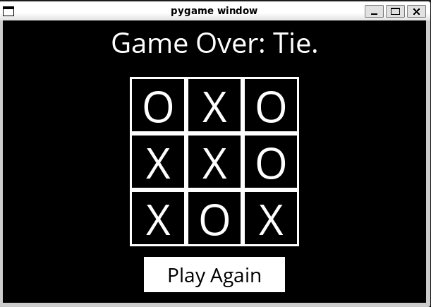
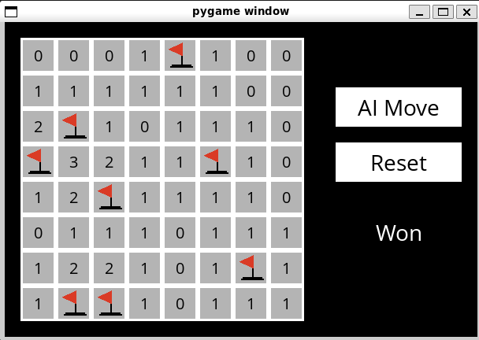

# Harvard-CS50ai-2023-Solutions
# ‼️ WARNING ‼️
This repository contains solutions to the CS50ai  projects. If you intend to take this course in the future, please read [the Academic Honesty policy](https://cs50.harvard.edu/ai/2023/honesty/)
  before viewing the solutions.
This course has a zero-tolerance plagiarism policy.

## Week 0

### Projects
- [degrees](degrees)
- [Tic-Tac-Toe](tictactoe)

## Week 1

### Projects
- [Knights](knights)
- [Minesweeper](minesweeper)
- 

